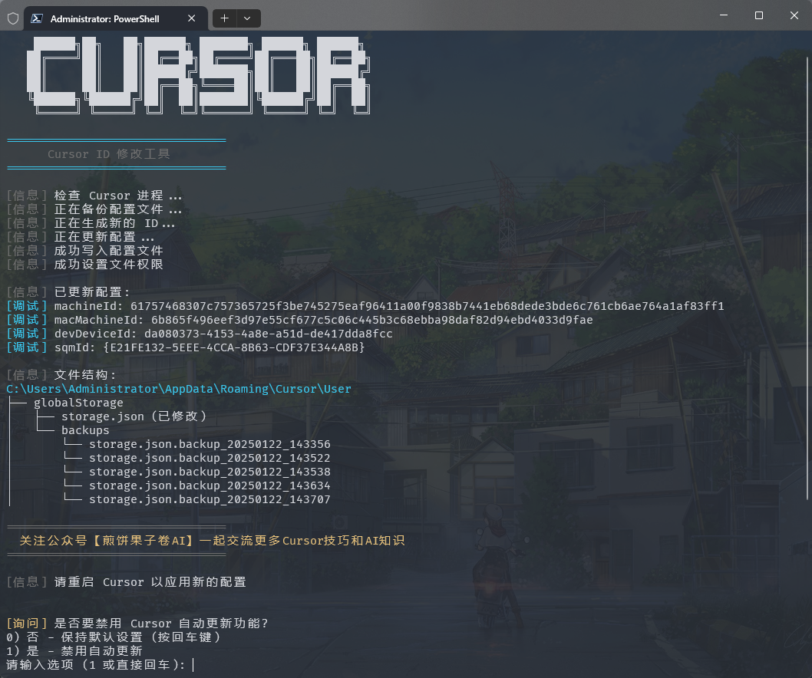
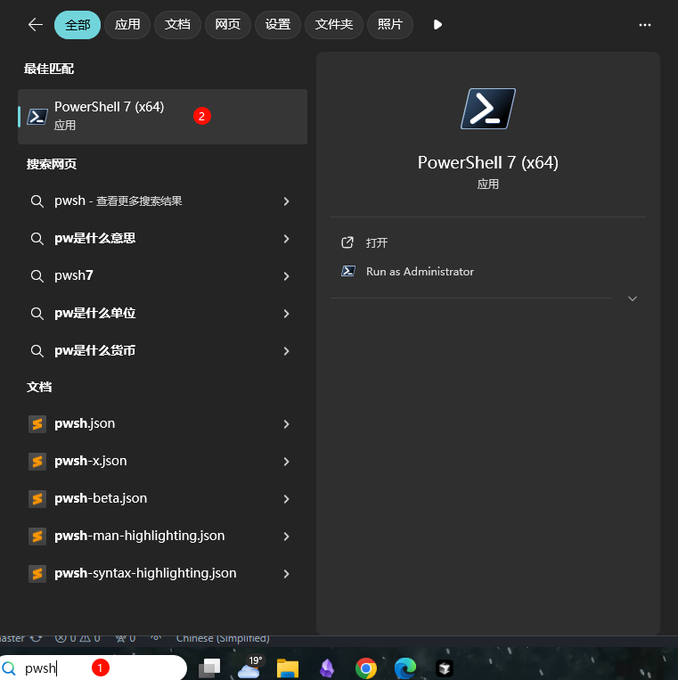
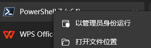

# 🚀 Windsurf Trial Reset Tool

<div align="center">

[](https://opensource.org/licenses/MIT)
[](https://github.com/topics/windows)
[](https://github.com/topics/powershell)
[](https://github.com/abushaidislam/windsurf-trial-reset/stargazers)
[](https://github.com/abushaidislam/windsurf-trial-reset/issues)

**⚠️ EDUCATIONAL PURPOSES ONLY - USE AT YOUR OWN RISK**

[📖 Documentation](#documentation) • [🚀 Quick Start](#quick-start) • [🤝 Contributing](CONTRIBUTING.md) • [📋 Issues](.github/ISSUE_TEMPLATE/bug-report.md)


*A tool to reset Windsurf editor trial periods by modifying machine identification data*

</div>

---

## 📊 Environment Details

- **Created**: April 29, 2026
- **Last Updated**: April 29, 2026
- **Platform**: Windows (Primary), macOS/Linux (Limited Support)
- **PowerShell**: 5.1+ Required
- **Repository**: https://github.com/abushaidislam/windsurf-trial-reset

---

## ⚠️ **Important Disclaimer**

<div align="center">

### **This tool is for educational purposes only!**

**By using this tool, you acknowledge that:**
- You understand the risks of modifying application data
- You accept full responsibility for any consequences
- This tool may violate Windsurf's Terms of Service
- The authors are not responsible for any issues that may arise

**Use at your own risk. The authors assume no liability.**

</div>

---

## ✨ Features

- 🔄 **Reset Trial Periods**: Reset Windsurf editor trial periods
- 🪟 **Windows Support**: Optimized for Windows 10/11
- 🛡️ **Safe Operations**: Creates automatic backups before modifications
- 🔧 **Multiple Methods**: Simple and advanced reset options
- 📊 **Progress Tracking**: Real-time operation status
- 🔙 **Easy Restore**: Backup restoration capabilities

## 🚀 Quick Start

### Option 1: Simple Reset (Recommended)
```powershell
# Download and run the simple reset tool
cd "C:\Path\To\Your\Folder"
powershell -ExecutionPolicy Bypass -File "windsurf_reset.ps1"
```

### Option 2: Advanced Reset
```powershell
# Download and run the full-featured tool
irm https://raw.githubusercontent.com/abushaidislam/windsurf-trial-reset/main/scripts/run/windsurf_win_id_modifier.ps1 | iex
```

## 📦 Installation

### Method 1: Clone Repository
```bash
git clone https://github.com/abushaidislam/windsurf-trial-reset.git
cd windsurf-trial-reset
```

### Method 2: Direct Download
```powershell
# Download the simple reset tool
Invoke-WebRequest -Uri "https://raw.githubusercontent.com/abushaidislam/windsurf-trial-reset/main/windsurf_reset.ps1" -OutFile "windsurf_reset.ps1"
```

## 🔧 Usage

### Basic Usage
1. **Close Windsurf** completely
2. **Run the reset tool** as Administrator
3. **Restart Windsurf**
4. **Check if trial is reset**

### Advanced Usage
```powershell
# Run with custom options
.\windsurf_reset.ps1 -SkipBackup  # Skip backup creation
```

### Configuration Files Modified
- **Windows**: `%APPDATA%\Windsurf\User\globalStorage\storage.json`
- **Backup Location**: `%APPDATA%\Windsurf\User\globalStorage\backups\`

## 🛠️ How It Works

This tool modifies Windsurf's telemetry and machine identification data:

1. **Machine ID**: Generates new unique machine identifier
2. **Device ID**: Creates new device fingerprint
3. **Telemetry Data**: Updates tracking information
4. **Session Data**: Resets session tracking

**Technical Details:**
- Modifies `storage.json` configuration file
- Updates telemetry keys: `machineId`, `devDeviceId`, `macMachineId`, `sqmId`
- Creates timestamped backups automatically

## 🤝 Contributing

We welcome contributions! Please see our [Contributing Guide](CONTRIBUTING.md) for details.

### Quick Contribution Guide
1. Fork the repository
2. Create a feature branch: `git checkout -b feature-name`
3. Make your changes
4. Test thoroughly
5. Submit a pull request

### Development Setup
```bash
# Clone and setup
git clone https://github.com/abushaidislam/windsurf-trial-reset.git
cd windsurf-trial-reset

# Make your changes
# Test on your system
# Submit PR
```

## 📋 Issues and Support

- 🐛 **Bug Reports**: [Create an issue](.github/ISSUE_TEMPLATE/bug-report.md)
- 💡 **Feature Requests**: [Create an issue](https://github.com/abushaidislam/windsurf-trial-reset/issues)
- 🤔 **Questions**: Check [existing issues](https://github.com/abushaidislam/windsurf-trial-reset/issues) first

## 📄 License

This project is licensed under the MIT License - see the [LICENSE](LICENSE) file for details.

**Note**: While the code is open source, the tool's purpose may conflict with Windsurf's Terms of Service. Use responsibly.

## ⚖️ Legal Disclaimer

This tool is provided "as is" without warranty of any kind. The authors are not responsible for:

- Any damages or data loss
- Violation of Windsurf's terms of service
- Account suspension or termination
- Any other consequences of use

**By using this tool, you accept all risks and responsibilities.**

## 🙏 Acknowledgments

- Original work based on community research
- Thanks to contributors and testers
- Built for educational purposes

---

<div align="center">

**Made with ❤️ for the developer community**

[⭐ Star this repo](https://github.com/abushaidislam/windsurf-trial-reset) • [🐛 Report Issues](https://github.com/abushaidislam/windsurf-trial-reset/issues) • [📧 Contact](mailto:abushaidislam@gmail.com)

</div>

  

> 💡 A true "veteran" package. Say goodbye to subscription anxiety and switch to pay-as-you-go while stock is available.

<!-- ==================== 📦 Windsurf Limited Edition Overview ==================== -->

<div align="center">

### 🗓️ 30-DAY LIMITED EDITION

> 🚀 **Windsurf Limited Edition Pay-as-you-go Membership** | 💰 **Price: $75 USD / 30 Days**

| 📋 Specs | 📅 Validity | 🛡️ After-sales |
| :---: | :---: | :---: |
| Official seat login, no plugins or intermediaries. Supports Claude 4.6 Opus and GPT 5.4. Around 1-3 uses per conversation. 500 uses available. | 30 Days | 30-Day Guarantee |

**(⚠️ Best pick if you want the most stable pay-as-you-go option right now)**

</div>

---

| Type | Offer | 💰 Price | 📦 Stock / Term | 💎 Key Notes |
|:---:|:---|:---:|:---:|:---|
| **🚀 Limited** | **Windsurf Pay-as-you-go Membership** 🗓️ `30 DAYS` | **$75 USD** | **In Stock** / 30 Days | Official account login, no plugins or intermediaries, Claude 4.6 Opus + GPT 5.4, about 1-3 uses per chat, 500 uses available |

> ℹ️ **Note**: Limited quantity, first come first served. The highest mode cannot be activated.

<details>
<summary>📋 <b>Offer Details</b> (Click to expand)</summary>

<br>

---

#### 💼 Membership Details
| Item | Description |
|:---|:---|
| **Seat Type** | Official seat. Log in with your official account directly |
| **Supported Models** | Core models including Claude 4.6 Opus and GPT 5.4 |
| **Usage** | Pay-as-you-go. Each conversation usually consumes about **1-3 uses**, depending on the model |
| **After-sales** | **30-day** after-sales guarantee. This is currently the most stable and worry-free option |
| **Availability** | **500 uses available**. Limited stock while supplies last |
| **Important Note** | The **highest mode cannot be activated** |

</details>

---

<!-- ==================== 📢 Purchase Notice & Contact ==================== -->

| ⚠️ **Before You Buy** | 📱 **Contact** |
|:---|:---|
| 💎 Official seat login, no plugins, no intermediaries |  [@yuaotian](https://t.me/yuaotian) |
| ⏱️ About 1-3 uses per conversation, depending on the model |  `JavaRookie666` |
| 🛡️ 30-day after-sales guarantee, limited stock | |

---
</div>

> ⚠️ **IMPORTANT NOTICE**
>
> This tool currently supports:
> - ✅ Windows: Latest 2.x.x versions (Supported)
> - ✅ Mac/Linux: Latest 2.x.x versions (Supported, feedback welcome)
>
> Please check your Windsurf version before using this tool.

---

### 🚀 One-Click Solution

<details open>
<summary><b>Global Users</b></summary>

**macOS**

```bash
curl -fsSL https://raw.githubusercontent.com/yuaotian/go-cursor-help/refs/heads/master/scripts/run/windsurf_mac_id_modifier.sh -o ./windsurf_mac_id_modifier.sh && sudo bash ./windsurf_mac_id_modifier.sh && rm ./windsurf_mac_id_modifier.sh
```

**Linux**

```bash
curl -fsSL https://raw.githubusercontent.com/yuaotian/go-cursor-help/refs/heads/master/scripts/run/windsurf_linux_id_modifier.sh | sudo bash
```

> **Note for Linux users:** The script attempts to find your Windsurf installation by checking common paths (`/usr/bin`, `/usr/local/bin`, `$HOME/.local/bin`, `/opt/windsurf`, `/snap/bin`), using the `which windsurf` command, and searching within `/usr`, `/opt`, and `$HOME`. If Windsurf is installed elsewhere or not found via these standard locations or methods, the script may fail. Ensure Windsurf is accessible via one of these standard locations or methods.

**Windows**

```powershell
irm https://raw.githubusercontent.com/yuaotian/go-cursor-help/refs/heads/master/scripts/run/windsurf_win_id_modifier.ps1 | iex
```

**Tip (Windows):** If you suspect a cached old script (mirror/proxy cache), append a timestamp query parameter to bypass cache:

```powershell
irm "https://raw.githubusercontent.com/yuaotian/go-cursor-help/refs/heads/master/scripts/run/windsurf_win_id_modifier.ps1?$(Get-Date -Format yyyyMMddHHmmss)" | iex
```

**Linux**

```bash
curl -fsSL https://raw.githubusercontent.com/yuaotian/go-cursor-help/refs/heads/master/scripts/run/cursor_linux_id_modifier.sh | sudo bash 
```

> **Note for Linux users:** The script attempts to find your Cursor installation by checking common paths (`/usr/bin`, `/usr/local/bin`, `$HOME/.local/bin`, `/opt/cursor`, `/snap/bin`), using the `which cursor` command, and searching within `/usr`, `/opt`, and `$HOME/.local`. If Cursor is installed elsewhere or not found via these methods, the script may fail. Ensure Cursor is accessible via one of these standard locations or methods.

**Windows**

```powershell
irm https://raw.githubusercontent.com/yuaotian/go-cursor-help/refs/heads/master/scripts/run/cursor_win_id_modifier.ps1 | iex
```

**Tip (Windows):** If you suspect a cached old script (mirror/proxy cache), append a timestamp query parameter to bypass cache:

```powershell
irm "https://raw.githubusercontent.com/yuaotian/go-cursor-help/refs/heads/master/scripts/run/cursor_win_id_modifier.ps1?$(Get-Date -Format yyyyMMddHHmmss)" | iex
```


</details>


<details open>
<summary><b>China Users (Recommended)</b></summary>

**macOS**

```bash
curl -fsSL https://wget.la/https://raw.githubusercontent.com/yuaotian/go-cursor-help/refs/heads/master/scripts/run/windsurf_mac_id_modifier.sh -o ./windsurf_mac_id_modifier.sh && sudo bash ./windsurf_mac_id_modifier.sh && rm ./windsurf_mac_id_modifier.sh
```

**Linux**

```bash
curl -fsSL https://wget.la/https://raw.githubusercontent.com/yuaotian/go-cursor-help/refs/heads/master/scripts/run/windsurf_linux_id_modifier.sh | sudo bash
```

**Windows**

```powershell
irm https://wget.la/https://raw.githubusercontent.com/yuaotian/go-cursor-help/refs/heads/master/scripts/run/windsurf_win_id_modifier.ps1 | iex
```

**Tip (Windows):** If the mirror caches old content, append `?$(Get-Date -Format yyyyMMddHHmmss)` to the URL:

```powershell
irm "https://wget.la/https://raw.githubusercontent.com/yuaotian/go-cursor-help/refs/heads/master/scripts/run/windsurf_win_id_modifier.ps1?$(Get-Date -Format yyyyMMddHHmmss)" | iex
```

</details>


<div align="center">

</div>

<details open>
<summary><b>Windows Terminal Run and Configuration</b></summary>

#### How to Open Administrator Terminal in Windows:

##### Method 1: Using Win + X Shortcut
```md
1. Press Win + X key combination
2. Select one of these options from the menu:
   - "Windows PowerShell (Administrator)"
   - "Windows Terminal (Administrator)"
   - "Terminal (Administrator)"
   (Options may vary depending on Windows version)
```

##### Method 2: Using Win + R Run Command
```md
1. Press Win + R key combination
2. Type powershell or pwsh in the Run dialog
3. Press Ctrl + Shift + Enter to run as administrator
    or type in the opened window: Start-Process pwsh -Verb RunAs
4. Enter the reset script in the administrator terminal:

irm https://raw.githubusercontent.com/yuaotian/go-cursor-help/refs/heads/master/scripts/run/windsurf_win_id_modifier.ps1 | iex
```

For the enhanced version:
```powershell
irm https://raw.githubusercontent.com/yuaotian/go-cursor-help/refs/heads/master/scripts/run/windsurf_win_id_modifier.ps1 | iex
```

##### Method 3: Using Search
>
>
>Type pwsh in the search box, right-click and select "Run as administrator"
>

Enter the reset script in the administrator terminal:
```powershell
irm https://raw.githubusercontent.com/yuaotian/go-cursor-help/refs/heads/master/scripts/run/windsurf_win_id_modifier.ps1 | iex
```

For the enhanced version:
```powershell
irm https://raw.githubusercontent.com/yuaotian/go-cursor-help/refs/heads/master/scripts/run/windsurf_win_id_modifier.ps1 | iex
```

For the enhanced version:
```powershell
irm https://wget.la/https://raw.githubusercontent.com/yuaotian/go-cursor-help/refs/heads/master/scripts/run/cursor_win_id_modifier.ps1 | iex
```

##### Method 3: Using Search
>
>
>Type pwsh in the search box, right-click and select "Run as administrator"
>

Enter the reset script in the administrator terminal:
```powershell
irm https://wget.la/https://raw.githubusercontent.com/yuaotian/go-cursor-help/refs/heads/master/scripts/run/cursor_win_id_modifier.ps1 | iex
```

For the enhanced version:
```powershell
irm https://wget.la/https://raw.githubusercontent.com/yuaotian/go-cursor-help/refs/heads/master/scripts/run/cursor_win_id_modifier.ps1 | iex
```

### 🔧 PowerShell Installation Guide 

If PowerShell is not installed on your system, you can install it using one of these methods:

#### Method 1: Install via Winget (Recommended)

1. Open Command Prompt or PowerShell
2. Run the following command:
```powershell
winget install --id Microsoft.PowerShell --source winget
```

#### Method 2: Manual Installation

1. Download the installer for your system:
   - [PowerShell-7.4.6-win-x64.msi](https://github.com/PowerShell/PowerShell/releases/download/v7.4.6/PowerShell-7.4.6-win-x64.msi) (64-bit systems)
   - [PowerShell-7.4.6-win-x86.msi](https://github.com/PowerShell/PowerShell/releases/download/v7.4.6/PowerShell-7.4.6-win-x86.msi) (32-bit systems)
   - [PowerShell-7.4.6-win-arm64.msi](https://github.com/PowerShell/PowerShell/releases/download/v7.4.6/PowerShell-7.4.6-win-arm64.msi) (ARM64 systems)

2. Double-click the downloaded installer and follow the installation prompts

> 💡 If you encounter any issues, please refer to the [Microsoft Official Installation Guide](https://learn.microsoft.com/en-us/powershell/scripting/install/installing-powershell-on-windows)

</details>

#### Windows 安装特性:

- 🔍 Automatically detects and uses PowerShell 7 if available
- 🛡️ Requests administrator privileges via UAC prompt
- 📝 Falls back to Windows PowerShell if PS7 isn't found
- 💡 Provides manual instructions if elevation fails

That's it! The script will:

1. ✨ Install the tool automatically
2. 🔄 Reset your Cursor trial immediately

### 📦 Manual Installation

> Download the appropriate file for your system from [releases](https://github.com/yuaotian/go-cursor-help/releases/latest)

<details>
<summary>Windows Packages</summary>

- 64-bit: `windsurf-id-modifier_windows_x64.exe`
- 32-bit: `windsurf-id-modifier_windows_x86.exe`
</details>

<details>
<summary>macOS Packages</summary>

- Intel: `windsurf-id-modifier_darwin_x64_intel`
- M1/M2: `windsurf-id-modifier_darwin_arm64_apple_silicon`
</details>

<details>
<summary>Linux Packages</summary>

- 64-bit: `windsurf-id-modifier_linux_x64`
- 32-bit: `windsurf-id-modifier_linux_x86`
- ARM64: `windsurf-id-modifier_linux_arm64`
</details>

### 🔧 Technical Details

<details>
<summary><b>Configuration Files</b></summary>

The program modifies Windsurf's `storage.json` config file located at:

- Windows: `%APPDATA%\Windsurf\User\globalStorage\storage.json`
- macOS: `~/Library/Application Support/Windsurf/User/globalStorage/storage.json`
- Linux: `~/.config/Windsurf/User/globalStorage/storage.json`
</details>

<details>
<summary><b>Modified Fields</b></summary>

The tool generates new unique identifiers for:

- `telemetry.machineId`
- `telemetry.macMachineId`
- `telemetry.devDeviceId`
- `telemetry.sqmId`
</details>

<details>
<summary><b>Manual Auto-Update Disable</b></summary>

Windows users can manually disable the auto-update feature:

1. Close all Windsurf processes
2. Delete directory: `C:\Users\username\AppData\Local\windsurf-updater`
3. Create a file with the same name: `windsurf-updater` (without extension)

macOS/Linux users can try to locate similar `windsurf-updater` directory in their system and perform the same operation.

</details>

<details>
<summary><b>Safety Features</b></summary>

- ✅ Safe process termination
- ✅ Atomic file operations
- ✅ Error handling and recovery
</details>

<details>
<summary><b>Registry Modification Notice</b></summary>

> ⚠️ **Important: This tool modifies the Windows Registry**

#### Modified Registry
- Path: `Computer\HKEY_LOCAL_MACHINE\SOFTWARE\Microsoft\Cryptography`
- Key: `MachineGuid`

#### Potential Impact
Modifying this registry key may affect:
- Windows system's unique device identification
- Device recognition and authorization status of certain software
- System features based on hardware identification

#### Safety Measures
1. Automatic Backup
    - Original value is automatically backed up before modification
    - Backup location: `%APPDATA%\Windsurf\User\globalStorage\backups`
    - Backup file format: `MachineGuid.backup_YYYYMMDD_HHMMSS`

2. Manual Recovery Steps
    - Open Registry Editor (regedit)
    - Navigate to: `Computer\HKEY_LOCAL_MACHINE\SOFTWARE\Microsoft\Cryptography`
    - Right-click on `MachineGuid`
    - Select "Modify"
    - Paste the value from backup file

#### Important Notes
- Verify backup file existence before modification
- Use backup file to restore original value if needed
- Administrator privileges required for registry modification
</details>

---

### 📚 Recommended Reading

- [Windsurf Issues Collection and Solutions](https://mp.weixin.qq.com/s/pnJrH7Ifx4WZvseeP1fcEA)
- [AI Universal Development Assistant Prompt Guide](https://mp.weixin.qq.com/s/PRPz-qVkFJSgkuEKkTdzwg)

---

## 💬 Feedback & Suggestions

We value your feedback on the new enhanced script! If you've tried the `windsurf_win_id_modifier.ps1` script, please share your experience:

- 🐛 **Bug Reports**: Found any issues? Let us know!
- 💡 **Feature Suggestions**: Have ideas for improvements?
- ⭐ **Success Stories**: Share how the tool helped you!
- 🔧 **Technical Feedback**: Performance, compatibility, or usability insights

Your feedback helps us improve the tool for everyone. Feel free to open an issue or contribute to the project!

---

##  Support

<div align="center">
<b>If you find this helpful, consider buying me a spicy gluten snack (Latiao) as appreciation~ 💁☕️</b>
<table>
<tr>

<td align="center">
<b>微信赞赏</b><br>
<br>
<small>要到饭咧？啊咧？啊咧？不给也没事~ 请随意打赏</small>
</td>
<td align="center">
<b>支付宝赞赏</b><br>
<br>
<small>如果觉得有帮助,来包辣条犒劳一下吧~</small>
</td>
<td align="center">
<b>Alipay</b><br>
<br>
<em>1 Latiao = 1 AI thought cycle</em>
</td>
<td align="center">
<b>WeChat</b><br>
<br>
<em>二维码7天内(3月6日前前)有效，过期请加微信或者公众号`煎饼果子卷AI`</em>
</td>
<!-- <td align="center">
<b>ETC</b><br>
<br>
ETC: 0xa2745f4CD5d32310AC01694ABDB28bA32D125a6b
</td>
<td align="center"> -->
</td>
</tr>
</table>
</div>

### 💳 Payment Methods (Donate / Remove Ads)

- 🪙 **USDT (Tether)**
  - 🔴 TRC-20 (Tron): `TFbJnoY5Lep5ZrDwBbT8rV1i8xR4ZhX53k`
  - 🟡 Polygon / BSC / Arbitrum: `0x44f8925b9f93b3d6da8d5ad26a3516e3e652cc88`
- 🟦 **Litecoin (LTC)**: `LVrigKxtWfPymMRtRqL3z2eZxfncR3dPV7`

---

## ⭐ Project Stats

<div align="center">

[](https://star-history.com/#yuaotian/go-cursor-help&Date)


</div>

## 📄 License

<details>
<summary><b>MIT License</b></summary>

Copyright (c) 2024

Permission is hereby granted, free of charge, to any person obtaining a copy
of this software and associated documentation files (the "Software"), to deal
in the Software without restriction, including without limitation the rights
to use, copy, modify, merge, publish, distribute, sublicense, and/or sell
copies of the Software, and to permit persons to whom the Software is
furnished to do so, subject to the following conditions:

The above copyright notice and this permission notice shall be included in all
copies or substantial portions of the Software.

</details>


